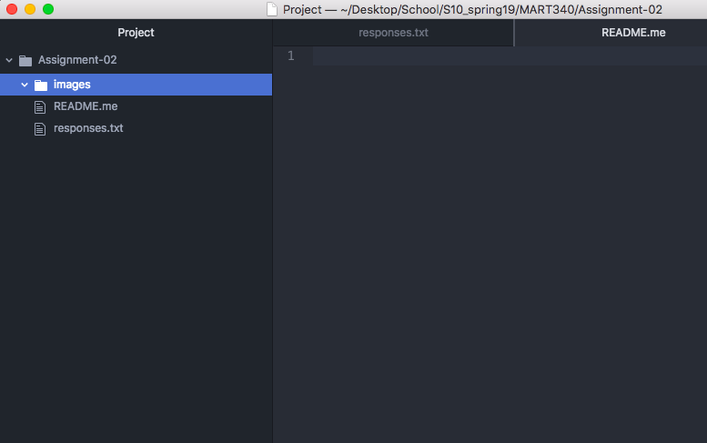

# Assignment-01
## Alyssa Dimmick

I decided to take this course because I am getting a CAS in Business Media Design and felt it would be beneficial to gain knowledge in how to build a website. Also, my advisor let me enroll for this course in place of another lower-division course needed for the CAS so that I can fulfill my upper-division course requirement for my BA.

1. How to use code to build the bones of a website
2. How to use code to make the website visually appealing
3. How to use code to make a website interactive

[Indeed](https://www.indeed.com/)

[My Responses File](./responses.txt)

