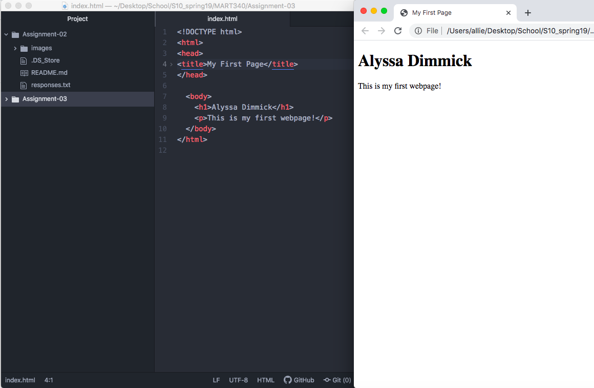

A browser uses a rendering engine that is gives visual representation of the webpage and an interface that presents the information to the user. The browser engine directs information between the interface, rendering engine and external servers.The browser also uses the network to recieve all of the images and other information that makes up the page. I currently only use Chrome as my web browser.

A markup language is what dictates the architecure of the page and is a combination of markup, style, and scripts, but focuses on text. HTML is the
first and most widely used internet language. It has a standardized element and tagging system and is used to render content and page structure. However, it requires frequent extensive version updates and the quality can vary across devices.

