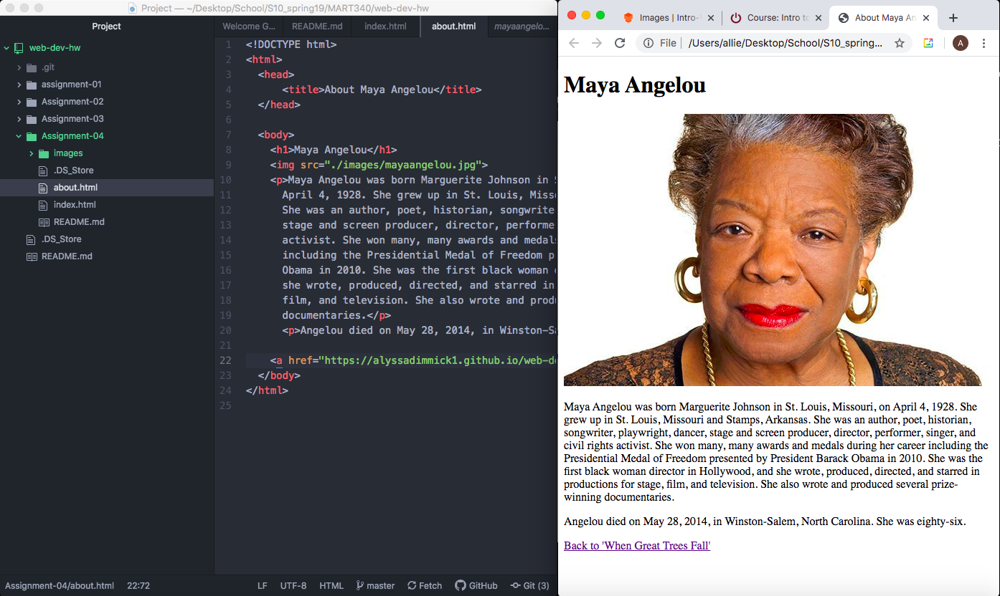

# Assignment 4

Using The Wayback Machine, I looked at Google on January 18, 2001. To my surprise, the webpage was very similar to what is today. The logo was a different font, but was the same colors, and the general layout of the page is almost exactly the same. A major difference now though, is that Google is no longer just a search engine as it was in 2001. Today's Google website has links to all of today's Googles features including Images, Gmail, Earth and much much more. It also has the ability to sign in to your own account and access individual and shared cloud information via Google Docs, Sheets, Slides etc.

Everything that we covered in the GIT Module was new information to me. I learned a ton and found it very rewarding to see my work be relayed onto an actual functioning webpage. I didn't find any of it to be particularly difficult, but each module had minor challenges that I had to work through. For example, in this module, when I added the photo into about.html, it was only showing an icon when I opened the webpage. It took some trial and error to realize that I forgot to include ./images/ to the command in the file. Then, once I figured that out, I saw that the image I chose was way too large and greatly overwhelmed my webpage, so I had to find a smaller version of it and fix that issue. Overall, I feel like I understand the material well though, and I have really enjoyed this course so far.

