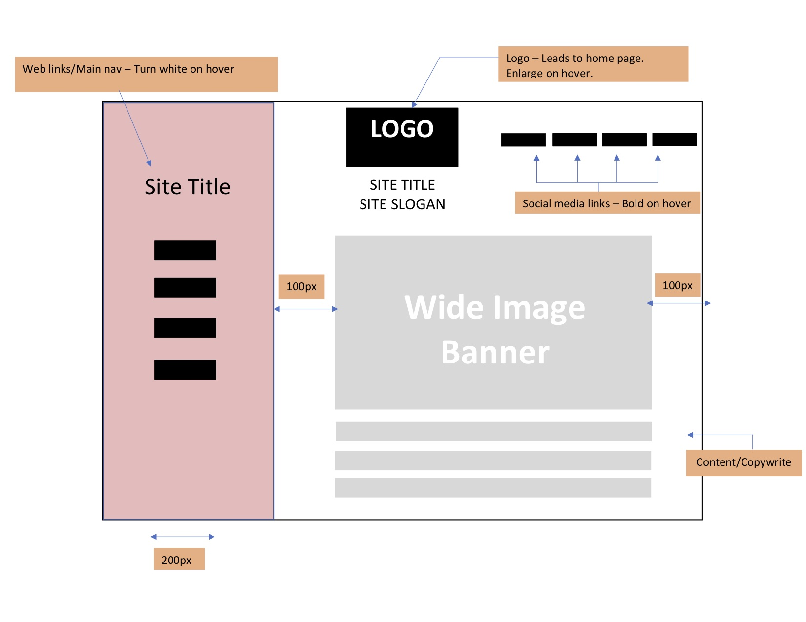

What is the difference between padding, margin, and borders? 
Padding is the amount of space between the inner content of the element and the element itself. Margin is the space between the box and other elements on the webpage. Margins also control the space between the element and the edges of the wepage itself. When you add padding, you add cushion between the outside of the box and the inner content of the element. Borders are the drawn edges around a box. Borders are a visual styling tool rather that a space management tool and can be separately colored and styled in various ways.

Embed the image of your sketch.

Free Response: Summarize your work cycle for this assignment. 
I found this assignment very challenging and time-consuming, but also helpful in learning how to control the position of elements on the webpage.

I began this assignment by creating my outline in a word document. I made sure to include all the required elements and took some time to think about design, color scheme, shapes, etc. Then I set up my assignment folder in Atom and added in the necessary files and folders required for this assignment. I then added the 4 main and meta document elements to my index file, and linked my style file to my index file. After that, I really mostly just followed along with the walkthrough video and adjusted elements as I needed to in order to fit the outline that I made. I had to spend some time figuring out how to position my logo and social media links outside of the navigation box and get them where I wanted them. I succeeded in this by adding the logo to the main div rather that the navigation and assigning and fixing the position of the social media links so that they stayed in the right corner. Once I got everything positioned the way that I wanted, I experimented with the aesthetic of my page. I searched for my font and colors online. I changed the font a few times until I was happy and I added the hover pseudo classes for the logo, site links, site info, and social media links and changed them around until I liked the result.
